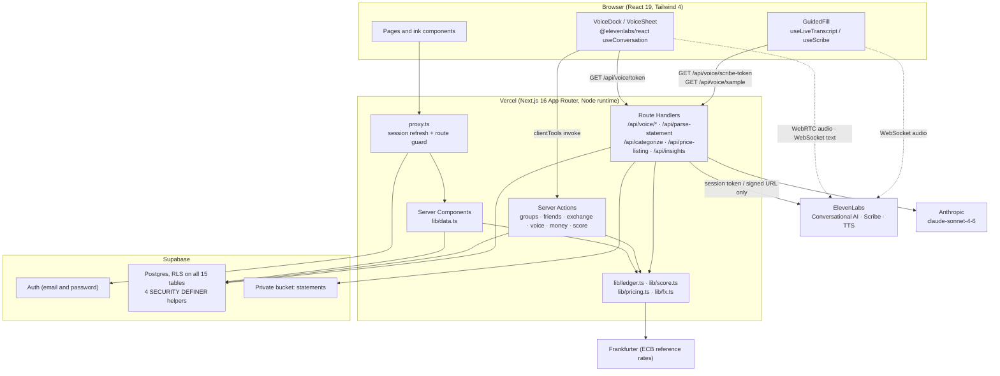
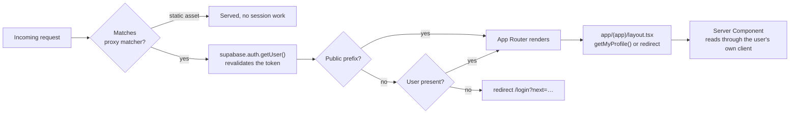
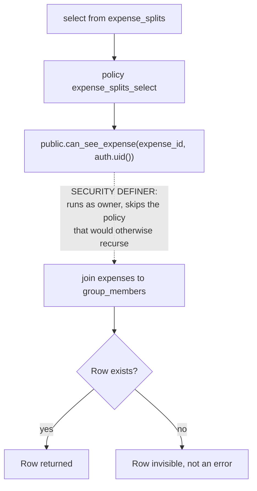
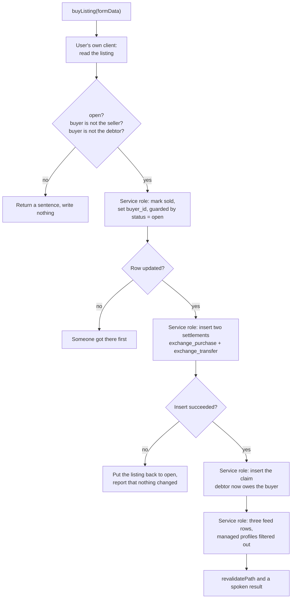

# Architecture

Split Tally is one Next.js 16 application on Vercel, one Supabase Postgres database with row level
security on every table, and two AI providers reached only from the server. There is no separate
backend service, no queue and no cache layer. Every number on screen is computed on the server from
rows the viewer is allowed to read.

This page is the map. [AI Integration](/docs/how-it-works/ai-integration) covers what the models do,
and [The Ledger](/docs/how-it-works/the-ledger) covers the money maths.

## The whole system

**Flowchart 3: From the browser to the database and out to the AI providers**

*Source: The author (2026).*

Two things in that diagram are worth stating plainly. First, the browser talks to ElevenLabs
directly, but it never holds the ElevenLabs key: it holds a short lived session credential minted by
`app/api/voice/token/route.ts`. Second, no browser code ever calls Anthropic. Every Anthropic call
goes through `lib/anthropic.ts`, which is marked `import "server-only"`.

**Figure 9: The authenticated shell at 1440px, with the dashboard and the docked orb**

## Auth and the session proxy

Signup collects an email and a password and nothing else. The rest of the profile is filled in by
the spoken onboarding, so a new profile row starts almost empty on purpose.

A Postgres trigger creates that row. `handle_new_user()` fires `after insert on auth.users` and
inserts into `public.profiles`, taking the name from `raw_user_meta_data` or falling back to the
part of the email before the `@`. There is deliberately no foreign key from `profiles.id` to
`auth.users`, because managed friends are profile rows with no auth row at all.

Next.js 16 renamed the `middleware` convention to `proxy`, and the runtime is Node and is not
configurable. `proxy.ts` at the repository root does two jobs on every matched request:

1. It refreshes the Supabase session by constructing a `createServerClient` with cookie handlers and
   calling `supabase.auth.getUser()`. The comment in the file is a warning to future readers:
   `getUser` revalidates the token with Supabase, and `getSession` only trusts whatever is in the
   cookie.
2. It redirects an unauthenticated visitor away from anything that is not public, carrying the
   intended path in `?next=`. `PUBLIC_PREFIXES` is `["/", "/login", "/signup", "/join"]`, so both
   onboarding routes are behind auth.

**Flowchart 4: What happens to a request before a page renders**

*Source: The author (2026).*

The matcher deliberately excludes `_next/static`, `_next/image`, the favicon, the OG image and every
common image extension. Those never need a session refresh, and paying for one on each would be
waste.

There is no redirect for a signed in visitor who lands on `/login` or `/signup`. That was a choice,
and the reason sits in a comment in `proxy.ts`: bouncing them looks exactly like a broken button.
Those pages render a signed in state instead, offering both ways out.

Signing out is broadcast. `components/app/SessionWatch.tsx` is mounted in the app layout and listens
for the sign out event Supabase already sends to every tab, because a QA pass found that signing out
in one tab left every other tab showing the previous person's name, avatar and balances.

## Why RLS is on every table

Fifteen tables, and `alter table … enable row level security` on all fifteen. The pattern is simple
to state: you read and write rows you own, group data is readable by group members, managed profiles
are writable by whoever created them, and listings are readable by every signed in user because the
Exchange is a public market.

The reason it is on *every* table rather than the sensitive ones is that the Tally Score makes almost
every table sensitive. A score is a claim about a person's repayment history, and the history behind
it lives in `expenses`, `expense_splits`, `settlements` and `claims`. If any one of those leaked, the
score would leak with it. `lib/scores.ts` computes scores from the history the viewer can actually
see, which is only a defensible design if the database is the thing enforcing what "can see" means.

### What a SECURITY DEFINER helper is doing

Four helper functions carry the load, and all four are `security definer` with
`set search_path = public`:

- `my_profile_ids()` returns `auth.uid()` plus every managed profile that user created. It is the
  answer to "which ids count as me", and it is what lets Ana see the friendships and settlements of
  a friend she added by name who has no account.
- `is_group_member(gid, uid)` is used by the `groups`, `group_members` and `expenses` policies.
- `can_see_expense(eid, uid)` joins `expenses` to `group_members`, and is used by the four
  `expense_splits` policies.
- `are_friends(a, b)` answers the connection question in either direction.

`SECURITY DEFINER` here is not a convenience, it is the fix for infinite recursion. A policy on
`group_members` that asks "is this row in one of my groups?" has to read `group_members`, which
evaluates the same policy, which reads `group_members` again. Running the check as the function's
owner steps outside the policy being evaluated and terminates.

The privilege that buys is then narrowed back down. Section 5b of the migration revokes `execute`
from `public` and `anon` on all four and grants it only to `authenticated`, and revokes it from
`authenticated` too on `handle_new_user()` and `claim_managed_profile()`, which are called from the
auth trigger and from a service role server action respectively and should never be reachable through
`/rest/v1/rpc`.

**Flowchart 5: How a read of one expense split is authorised**

*Source: The author (2026).*

### The four service role paths

Four flows genuinely cannot be expressed as a policy, so they run on the service role client inside a
server action with an explicit ownership check in code first. `createAdminClient()` in
`lib/supabase/server.ts` is the only way to reach it, and the file is `server-only`.

1. **Invite lookup**, in `app/(auth)/join/[code]/page.tsx`. The visitor has no session yet, so the
   code cannot be read as `authenticated`.
2. **The Exchange purchase**, in `app/(app)/exchange/actions.ts`. One act writes the listing, two
   settlements, a claim and three feed entries, and the buyer has no policy to update a listing they
   do not own. `buyListing` checks first that the listing is still open, that the buyer is not the
   seller, and that the buyer is not the debtor.
3. **Cross feed fan out on a purchase**, the same transaction writing into the debtor's feed.
4. **The managed profile claim**, `claim_managed_profile(new_user, signup_email)`, which runs
   immediately after signup and moves a stub profile's entire history onto the real account before
   that account could be authorised to touch any of it.

Everything else goes through the user's own client and is filtered by policy.

The purchase is the one worth drawing, because it is the only place where the ownership check lives
in TypeScript rather than in SQL, and because it rolls itself back.

**Flowchart 6: The Exchange purchase, and where the service role client starts and stops**

*Source: The author (2026).*

The `.eq("status", "open")` on that update is the concurrency guard: two simultaneous buyers race on
one row and exactly one of them updates it. The rollback branch exists because a sale with no ledger
behind it is worse than a failed sale.

## The schema

**Table 7: The fifteen tables, and what each one is for**

| Table | Holds | Notable columns |
|---|---|---|
| `profiles` | Real users and managed friends alike | `is_managed`, `created_by`, `voice_id`, `context` jsonb, `tally_score`, `improving_since`, `improving_used_at`, `onboarded_at` |
| `friendships` | Connections, in either direction | `requester`, `addressee`, `status` in `pending`/`accepted` |
| `invites` | Friend invite links | `code` primary key, `inviter`, `used_by` |
| `groups` | Shared ledgers | `currency`, `archived`, `simplify_debts` |
| `group_members` | Membership | composite key `(group_id, user_id)` |
| `expenses` | What was spent | `created_via` in `voice`/`manual`/`statement`, `deleted` soft delete |
| `expense_splits` | Each person's share of one expense | `share_amount`, key `(expense_id, user_id)` |
| `listings` | Tallies on the Exchange | `face_value`, `asking_price`, `ai_suggested_price`, `ai_rationale`, `status` |
| `settlements` | Payments and Exchange bookkeeping | `kind` in `settle`/`exchange_purchase`/`exchange_transfer` |
| `claims` | Who holds a debtor's obligation after a sale | `debtor_id`, `holder_id`, `open` |
| `statement_uploads` | One row per statement screenshot read | `storage_path`, `parsed_at` |
| `personal_transactions` | Personal cash flow | `source` in `statement`/`manual`/`voice`, `dedup_hash`, unique per `(user_id, dedup_hash)` |
| `budgets` | Monthly caps per category | key `(user_id, category)` |
| `checkins` | The weekly tally recap the agent writes | `summary` |
| `activity` | Per person feed | `user_id` is whose feed, `actor_id` is who did it, `type` checked against nine values |

Every foreign key has an index, and the two feeds carry a `(user_id, created_at desc)` index because
that is the only way they are ever read.

Three constraints are worth pointing at, because they encode product decisions rather than hygiene:

- `settlements.kind` is a check constraint with exactly three values, and `lib/ledger.ts` treats all
  three differently. That distinction is what makes the Exchange arithmetic correct, and it is
  explained in [The Ledger](/docs/how-it-works/the-ledger).
- `listings` carries `check (seller_id <> debtor_id)`, so nobody can list their own debt.
- `personal_transactions` is unique on `(user_id, dedup_hash)`, which is what stops the statement
  import and the spoken cash log from writing the same coffee twice. Both sides compute the hash the
  same way, `sha256` of `user | date | amount | lowercased description`.

## The storage bucket

Statement screenshots go into a bucket called `statements`, created by the migration with
`public = false`. Three policies on `storage.objects` gate insert, select and delete on the same
condition: the bucket is `statements` and `(storage.foldername(name))[1] = auth.uid()::text`. Each
user owns exactly the folder named after their own id.

The read path never hands the model a URL into that bucket.
`app/api/parse-statement/route.ts` checks that the requested path starts with `${user.id}/`, mints a
60 second signed URL with `createSignedUrl(path, 60)`, fetches the bytes itself, and sends them to
Anthropic as base64. The model receives an image, never a link.

Before any of that, the browser has already shrunk the file. `app/(app)/import/ImportFlow.tsx`
draws the image to a canvas at a maximum edge of 1600 pixels and uploads the compressed blob, so the
bucket never holds a full resolution photograph of somebody's bank statement.

**Figure 10: Choosing a statement screenshot, before anything is uploaded**

## The routes

**Table 8: Every route in the application**

| Route | Auth | What it does |
|---|---|---|
| `/` | public | Landing page |
| `/login`, `/signup` | public | Email and password, plus one click into the seeded demo |
| `/join/[code]` | public | Invite link, resolved through the service role client |
| `/onboarding/voice` | auth | Pick one of four voices, each audible before you choose |
| `/onboarding/talk` | auth | Spoken onboarding, with a typed fallback on the same five fields |
| `/dashboard` | auth | Balances, groups, the weekly tally card, activity preview |
| `/friends` | auth | Friends, requests, managed friends, invite links |
| `/groups/new` | auth | Create a group, by form or by talking |
| `/groups/[id]` | auth | Group ledger, expenses, settling, simplification, group settings |
| `/import` | auth | Statement screenshot to reviewed rows |
| `/money` | auth | Cash flow, categories, budgets, check in history, AI insights |
| `/exchange` | auth | Browse the market, your own listings, the sell walk |
| `/exchange/[id]` | auth | One listing, its score breakdown, and the demo purchase |
| `/activity` | auth | The full feed, grouped by day |
| `/score` | auth | The dial, the arithmetic, the record, the improvement tips |
| `/settings` | auth | Profile, voice, currency, sign out |
| `not-found` | n/a | 404 with the tally jelly |

Seven route handlers sit under `/api`, and every one of them begins by calling
`supabase.auth.getUser()` and returning 401 without a session. Three reach ElevenLabs
(`voice/token`, `voice/scribe-token`, `voice/sample`) and four reach Anthropic
(`parse-statement`, `categorize`, `price-listing`, `insights`). Each is covered in detail in
[AI Integration](/docs/how-it-works/ai-integration).

What matters architecturally is that every one of the seven has a defined behaviour when its key is
absent, and none of them is a 500:

- `voice/token` answers `mode: "public"` with the agent id when there is no API key, and a 503 with
  `error: "not_configured"` when there is no agent id either. The sheet turns that 503 into a
  sentence naming the forms that do the same work.
- `voice/scribe-token` answers 503, distinguishing `missing_permission` from `unavailable`, and the
  caller falls back to the browser recogniser.
- `voice/sample` answers 503 and the guided walk runs silently, with every question still on screen.
- `parse-statement` answers 503 naming `ANTHROPIC_API_KEY`, so the failure is diagnosable rather than
  mysterious.
- `categorize` returns `Other` for every row, which the interface shows plainly and the user can fix
  by hand.
- `price-listing` answers from `localPricing()` in `lib/pricing.ts`: same clamp, same response shape,
  `source: "local"` instead of `source: "ai"`.
- `insights` answers `{ insights: [], reason: "not_configured" }` and the card does not render.

That is what makes the deployment checklist in
[Setup and Deployment](/docs/using-it/setup-and-deployment) honest: a deployment with no AI keys at
all still runs, it just has fewer ways in.

**Figure 11: The orb saying plainly that the assistant is not connected on this deployment**

## Where the numbers are computed

Nothing in the browser recomputes a balance and nothing the client sends is trusted.

`lib/ledger.ts` holds every balance function, and it is pure: `computePairBalances`, `balancesFor`,
`totalsFor`, `groupNets`, `simplifyDebts`, `scoreStatsFor`, `scoreEvents`, `scorePeak` and
`resolveSplit` all take a snapshot of rows and return a value. `lib/data.ts` fetches that snapshot
through the user's own client, with `getLedgerRows()` wrapped in React `cache` so one render never
fetches it twice.

The consequence is that the spoken path and the typed path cannot diverge. `add_expense` spoken to
the orb lands in `addExpenseTool` in `app/(app)/voice/actions.ts`, which resolves names and then
calls the same `addExpense` server action the manual form calls, with `via: "voice"` as the only
difference. The one million ceiling in `lib/format.ts` (`MAX_ENTRY`), the positive amount check and
the group membership check apply identically to both.

## Currency

`lib/fx.ts` fetches European Central Bank daily reference rates through `api.frankfurter.dev`. No
key, no account, no quota, which keeps it inside the "only shipping technology" constraint. Responses
are cached for one hour with `next: { revalidate: 3600 }`, which is generous given the ECB publishes
once a working day.

`convertTotals()` folds per currency amounts into one figure, reports any currency it had no rate for
rather than silently dropping it, and returns the rate date so the interface can label the figure. If
Frankfurter is unreachable the function returns the target currency total on its own with every other
currency listed as unconverted, and the dashboard says so. A converted total is a convenience. The
ledger stays in the currency each tally was made in.

**Figure 12: The same shell at 375px, with the five bottom tabs and the orb clear of them**

## Deployment

Vercel, with `vercel.json` pinning the framework to Next.js. That file exists because a project
created against an empty repository never auto detects the framework, falls back to the static preset
and fails with *No Output Directory named "public" found*. This application has no `public/`
directory because it needs none.

The build is clean with no environment variables at all, and then every page answers 500, because
`proxy.ts` needs Supabase on each request. A green deploy is not a working one.

`lib/site.ts` resolves the deployment's own address for the two server actions that call this
application's own API routes. `NEXT_PUBLIC_SITE_URL` wins when set, `VERCEL_PROJECT_PRODUCTION_URL`
or `VERCEL_URL` is the fallback, and `http://localhost:3000` is the last resort. That fallback exists
because a deployment missing the variable would otherwise reach for localhost, fail, and silently
fall back to the local pricing model: working, but never asking Anthropic anything.
