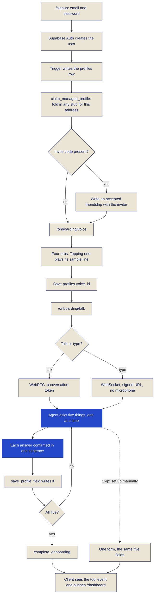
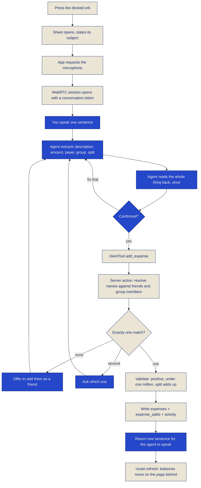
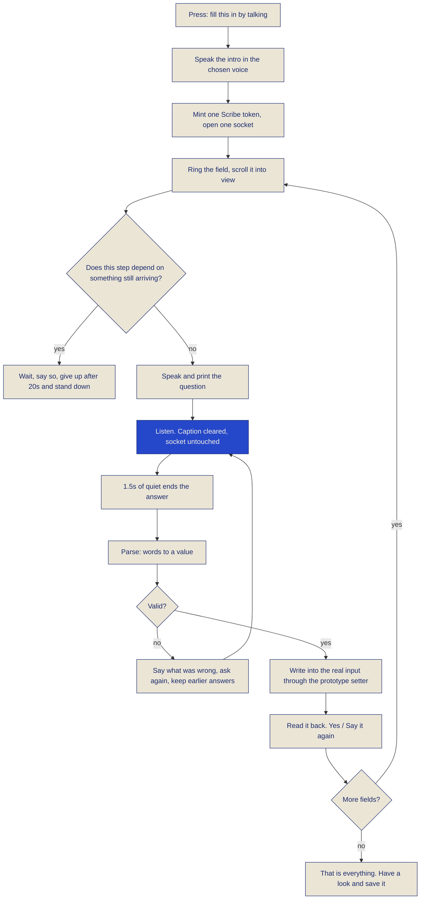
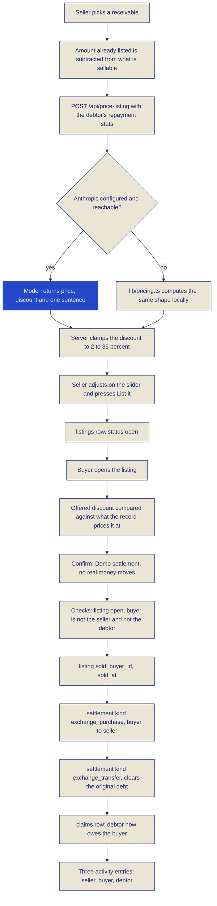

# User flows

Every flow in Split Tally, in the order a person meets them, step by step. Each step says who did
the work: the model, or code that would give the same answer twice.

That distinction matters more here than in most products, because the thesis is that talking is a
write path rather than a novelty. A write path has to be trustworthy. So the assistant is allowed to
hear, extract and confirm, and it is never allowed to compute a balance, decide a split, price a
tally outside the clamp, or write a row it has not read back to you first. Every one of the thirteen
client tools calls the same server action the corresponding form calls, and the validation lives in
that server action, not in the prompt.

:::tip[What you are looking at]
Every screen on this page is the deployed app at
[split-tally-seven.vercel.app](https://split-tally-seven.vercel.app), signed in as the seeded demo
account, against the real Supabase database. The one thing that is simulated anywhere in the product
is the money movement at the end of an Exchange purchase, and it is labelled on the screen where it
happens.
:::

## Reading this page

Table 13 is the whole page in one grid: every flow, what the model does in it, and what is
deterministic. If you only read one thing here, read this.

<div className="st-figure">

**Table 13: every flow, and which half of it is AI**

| Flow | The AI part | The deterministic part |
|---|---|---|
| Signing up | Nothing. Email and password only | Supabase Auth, an eight character minimum, `claim_managed_profile` folding in any stub created for that address |
| Choosing a voice | ElevenLabs text to speech renders the sample line | The four voices and their ids come from `lib/voices.ts` and the environment |
| Spoken onboarding | The agent asks five things, hears the answers, confirms each | `save_profile_field` and `complete_onboarding` write the profile; the redirect fires on the tool event, not on a sentence |
| The dashboard | Nothing | Every figure is computed by `lib/ledger.ts` server side, converted at the ECB daily rate |
| An expense, spoken | Extraction of description, amount, payer, group and split, plus one confirmation | Name resolution, the split arithmetic, the one million ceiling, the write, the spoken summary string |
| An expense, typed | Nothing | The same server action, four split modes, a live remainder that blocks a split which does not add up |
| Filling a form by voice | Speech to text only. No agent runs | The question order, the parse, the validation and the value that lands in each input |
| Settling up | Optional: `mark_settled` from the conversation | The outstanding amount, the pair it applies to, the netting arithmetic |
| Snapping a statement | Vision reads the image; a second call categorises the lines | Compression, the private bucket, the signed URL, the dedup hash, the eleven allowed categories |
| The weekly tally | Three questions, and a two sentence recap in the assistant's own words | `log_cash_spending` and `complete_checkin` write rows; the card appears on a seven day rule |
| The Tally Score | Nothing | `lib/score.ts`, replayed from settlements on every read |
| Selling a tally | The price and the one sentence rationale | The 2% to 35% clamp, what is already listed counting against what is left to sell |
| Buying a tally | Nothing | One transaction: the listing, two settlements, a claim and three feed entries |

</div>

---

## Signing up

Signup collects an email and a password. Nothing else. That is the product argument stated in a
form: everything a normal app asks for on the way in is asked for out loud a moment later, by
something that can also confirm it heard you correctly.

1. `/signup`. Two fields. The password has to be eight characters, and the hint says so before you
   submit rather than after.
2. Supabase Auth creates the user. A database trigger writes the matching `profiles` row.
3. `claim_managed_profile` runs immediately, on the service role client, before the new account
   could be authorised to touch anything. If a friend had already added you by name as a *managed
   friend*, that stub's group memberships, splits and settlements move onto the real account inside
   one transaction and the stub is deleted. You arrive with your history already in place.
4. If you arrived through an invite link, `/join/CODE`, the same step writes an accepted friendship
   with whoever invited you.
5. Redirect to `/onboarding/voice`.

There is one honest catch, and it is stated in the interface rather than hidden: if Supabase has
email confirmation switched on, `signUp` returns no session, so the app cannot walk you into the
spoken onboarding. It says exactly that, and names the setting to change.

Flowchart 14 is the whole path from a blank signup form to a ledger that is ready to be written to.

<div className="st-figure">

**Flowchart 14: signing up, choosing a voice, and talking through onboarding**



</div>

## Choosing a voice

`/onboarding/voice` is four spheres: **Cobalt**, **Indigo**, **Ultramarine**, **Cerulean**. Two by
two on a phone, in a row on a laptop. Each wears its own gradient and its own pair of drifting light
pools, so four voices read as four characters before you have heard any of them.

Tapping one plays its sample line, *"Hi, I'm Cobalt. Let's keep your tallies."*, rendered by
ElevenLabs text to speech through `/api/voice/sample`. The route is a proxy: it checks your session,
calls ElevenLabs with the server side key, and streams audio bytes back. The key never reaches the
browser and the browser never learns the voice id it did not already have.

The descriptions under each name say only what is actually known about the voice, because tapping it
plays the real thing and that is the honest way to choose. If no voice ids are configured on a
deployment, the page says so plainly and the agent falls back to its own default voice.

<div className="st-figure">

**Figure 25: choosing a voice, four aurora orbs each with its own gradient and its own pair of drifting light pools**


</div>

## Spoken onboarding

`/onboarding/talk` is the orb, full screen, and a line that asks permission before anything asks for
your microphone: *"I'll ask for your microphone so we can talk. You can type instead at any time,
and everything I say is written on screen."*

Two buttons: **Talk** and **Type**. They are two genuinely different transports, not one with a
toggle. Talking opens a WebRTC session with a short lived conversation token. Typing opens a
WebSocket with a signed URL and never touches the audio pipeline at all, because a typed
conversation should not need a microphone or a media stream. Pressing Talk asks for the microphone
before the SDK does, so a refusal is the app's to explain rather than a silent failure inside a
library.

The conversation itself:

1. The agent opens on the subject you pressed for: *"Let's set your ledger up. What should I call
   you?"* A conversation that names its subject at the first turn cannot drift into a different one.
2. Five things, one at a time: what to call you, student or professional or something else, your
   default currency, who you usually share costs with, and what you are trying to sort out.
3. After each answer it confirms in one sentence. **Yes** and **Fix that** chips sit under the last
   thing it said, and clicking one sends that text into the same conversation, so a chip and a spoken
   "yes" are the same event.
4. Only after the confirmation does it call `save_profile_field`.
5. After the fifth, `complete_onboarding`, and *"Your ledger is ready. From now on, just tell me
   what you spend."*
6. The redirect to `/dashboard` fires when the client sees the `complete_onboarding` tool result,
   not when it hears a closing sentence. A sentence can be improvised. A tool call cannot.

While it listens, the orb swells with your voice. That is the agent's own voice activity score
driving the sphere's scale in real time, not a second transcriber: the agent holds the microphone
over WebRTC for the whole conversation and a second consumer of the same device is what makes the
browser's recording indicator flicker on and off. One conversation, one microphone.

The discreet way out is a link, **Skip: set up manually**, which opens one compact form writing
exactly the same five fields. Nobody is penalised for not wanting to talk, and that form is also
where the guided walk lives, described further down.

<div className="st-figure">

**Figure 26: the spoken onboarding, the orb mid-answer with the conversation written underneath it**


</div>

## The dashboard

The dashboard is the only screen in the app that is entirely deterministic, and it is deliberately
the one you see most. Figure 2 on the [home page](/) shows it at 1440px.

What is on it, and where each number comes from:

- **Owed to you** and **You owe**, in the display face, per currency, plus one combined figure
  converted at the European Central Bank's daily reference rate with the rate's date named
  underneath. The conversion is labelled a convenience: a tally stays in the currency it was made in.
- **Your Tally Score**, as a dial in the top right, linking to the page that explains it.
- **The Weekly Tally card**, when the last check-in is seven days old or has never happened. When it
  is recent, the same slot holds the assistant's two sentence recap of the last one instead.
- **Tallies you bought on the Exchange**: what you paid against what you are owed, per currency,
  labelled *"if they all pay"*. It is a position until the debtor settles, not a profit, and the copy
  says so.
- **Your groups**, each with a brush stroke cover chosen deterministically from the group's id, the
  members' initials, and the expense count in tally marks.
- **Recent activity**, six entries, with the full feed a click away.

Balances are pairwise and computed server side in `lib/ledger.ts` and nowhere else. The client is
never trusted with a number it could have got wrong.

## Recording an expense by talking

This is the flow the whole product is arranged around. The orb is docked on every authenticated
page, bottom right, above the tab bar on a phone and clear of the safe area.

1. Press the orb. It opens as a right hand panel on a laptop and a bottom sheet on a phone, with
   the page still legible behind a blur, so it is obvious which screen is being written to.
2. Before it connects, it states what it is for: *"Tell me what you spent. Say it the way you would
   to a friend. I will work out the amount, who paid and how to split it, and I confirm once before
   anything is written."*
3. Press **Talk**. The app asks for the microphone itself, then opens the WebRTC session. The
   caption under the orb reads Listening, then Hearing you while you speak, then Speaking.
4. Say it: *"I paid 62 euros for lunch with Paulo in Barcelona Trip, split it equally."*
5. The agent extracts description, amount, payer, group and split, and reads the whole thing back
   once: *"You paid 62 euros for lunch with Paulo in the Barcelona Trip group, split equally. Is
   that right?"*
6. Say yes, or press the **Yes** chip.
7. `add_expense` runs. The server action resolves the names, validates, and writes the `expenses`
   row, the `expense_splits` rows and the `activity` entry. It returns one sentence for the agent
   to speak.
8. The page refreshes underneath the sheet. The new row carries a small orb glyph, and the database
   records `created_via='voice'`.

Name resolution is deterministic and shared by every voice tool: normalise, strip accents, match
against your friends and the members of your groups by first name prefix. Exactly one match
proceeds. More than one produces a question, *"Which Paulo: Paulo M. or Paulo R.?"*. None produces
an offer to add them. An exact full name or username wins outright, so "Paulo Ramos" never turns
into a disambiguation question just because a Paulo Reis also exists.

Two limits worth naming, because both are enforced in the server action rather than in the prompt:
an entry cannot exceed one million, on both the expense and the settlement paths, and a split has to
add up before it writes. Speaking and typing are held to exactly the same rule.

If the room is loud, or the microphone is blocked, or you would simply rather not talk, the text
input at the bottom of the same sheet feeds the same conversation. Nothing else changes.

<div className="st-figure">

**Figure 27: an expense recorded by talking, from the spoken sentence to the row in the ledger**


</div>

Flowchart 15 is the same journey with the boundary between the model and the ledger drawn on it.

<div className="st-figure">

**Flowchart 15: a spoken expense, from speech to three database rows**



</div>

## Recording an expense by typing

The manual form exists for two reasons. It is the fallback when voice is unavailable, and it is the
contrast that makes speaking look like a shortcut rather than a gimmick. It is not a lesser path:
both write through the same server action.

On a group page, the form asks for what it was, the amount, the date (already today), who paid
(already you), and a category (optional, and left as *Not sorted yet* if you do not care). Then the
split, in the four modes of Table 14.

<div className="st-figure">

**Table 14: the four split modes, and what each one enforces**

| Mode | What you type | What blocks the save |
|---|---|---|
| Equally | Nothing. Tick who is in | Nothing. The remainder is distributed to the cent |
| Exact amounts | What each person owes | Anything other than the total. The line reads "€4.50 still to allocate" or "€2.00 over the total" |
| Percentages | A percentage each | Anything other than 100. The line reads "12% left" or "3% over" |
| Shares | A share count each | Nothing. Two shares costs twice one share |

</div>

Every mode shows a live per-person preview beside the name as you type, and a remainder line in
vermilion until it resolves. The submit button stays live, but the split will not save until it adds
up, and a line beside the button says so rather than leaving you to guess.

One thing on this form is not on any other expense form anywhere: when *you* are the one paying, and
one of the people about to owe you has a repayment record that says something, a note appears under
the split. A slow payer gets a plain sentence about how long they take and how many of their tallies
are already past a month. A reliable friend gets nothing at all, because a good record should be
quiet, not congratulated. Owing a slow payer is not a risk; being owed by one is.

<div className="st-figure">

**Figure 28: the group page at 1440px, the expense form on the left, settling up and "who pays whom" on the right**


</div>

## Filling a form by voice: the guided walk

This is the third way to write, and it is deliberately not the conversational agent.

An agent is the right tool for open ended input, where the shape of the answer is unknown. A known
list of fields is better walked deterministically, because then the order, the confirmation and the
value that lands in each input are guaranteed rather than hoped for. It also costs nothing per turn.

Press **Fill this in by talking** and:

1. The orb speaks a short intro in the voice you chose at onboarding, so nobody is surprised by
   what is about to happen.
2. A hand drawn ring appears around the first field. Not a box: a loop, wobbled by a turbulence
   filter, with the overshoot a pen makes where it closes. It is anchored to the live element, so it
   follows scrolling and resizing, and the field is scrolled into view under it.
3. The question is spoken and written, in a panel that rides under the field so the question and the
   answer are in the same place on screen.
4. It listens. Speech to text is ElevenLabs Scribe on `scribe_v2_realtime`, holding one socket and
   one microphone stream for the entire walk, with end of utterance decided server side so nothing
   restarts to notice a pause. A single use token is minted per session through
   `/api/voice/scribe-token`, so the key never reaches the browser. Without the `speech_to_text`
   permission it falls back to the browser's own recogniser, which works but cycles the microphone.
5. About a second and a half of quiet ends the answer, the way it would in conversation. Nobody has
   to press a button to stop talking.
6. The answer is parsed, then validated. "Sixty two" becomes `62`. "Me" becomes your own name.
   "Euros" becomes `EUR`. An answer that fails validation asks again and keeps every earlier answer.
7. The value is written into the real input, through the DOM prototype's own setter so React's
   cached value updates too, then `input` and `change` are dispatched. The field fills the way it
   would if you had typed it, and it survives the next render.
8. It reads back what it put down, with **Yes** and **Say it again** chips.
9. On to the next field. At the end: *"That is everything. Have a look and save it when you are
   happy."*

The walk is wired into four places: the manual onboarding form (five fields), the expense form
(three), group creation, and the sell flow on the Exchange. The expense form asks only three things,
because the date already says today and the split already says equally between everyone, and asking
about either out loud would make the fast path slower than the form.

The sell walk stops at two questions and deliberately does not ask a third. Selling a tally moves
money and hands somebody else's debt to a stranger, so the last press stays a press. Nobody should
discover they sold something because a recogniser heard "yes" in a noisy room.

Two failure states are their own states rather than silences. If the microphone is refused, the
panel says so and stands down, because there is nothing to fall back to when both engines want the
same device. And if a step is waiting on something that has not arrived, such as a price the model
is still working out, it waits, says *"One moment, working that out…"*, and after twenty seconds
admits the wait and stands down rather than claiming to be finished.

<div className="st-figure">

**Figure 29: the guided walk, the hand-drawn ring following the field it is asking about**


</div>

Flowchart 16 is the loop. Every box in it is deterministic except the transcription itself.

<div className="st-figure">

**Flowchart 16: the guided walk, one microphone acquisition for the whole form**



</div>

## Settling up

Settling is a form, and it should be. It is the one moment in the product where a person is
recording that money genuinely changed hands, and a form that shows both names and the amount is the
clearest way to be sure.

On a group page, the **Settle up** card has two selects and an amount. Picking a pair prefills the
amount with whatever is outstanding between exactly those two people, and the hint underneath states
it: *"€50.00 is outstanding between them."* If nothing is outstanding, it says that instead of
silently offering zero. **Record the payment** writes a `settlements` row, and every balance, every
Tally Score and every feed that depends on it follows.

The same thing can be said out loud, through `mark_settled`, with the same ceiling and the same
validation.

Beside it sits **Who pays whom**, which answers the question two ways.

- **Literal**, the default: every pair that owes something, listed.
- **Netted**: min cash flow simplification first, so a ring of debts cancels. If you owe Pedro 5,
  Pedro owes Júlia 5 and Júlia owes you 5, nobody owes anybody.

Netting is off by default on purpose. It can ask you to pay someone you never borrowed from, and a
balance that quietly rearranges itself is not something to opt anyone into. Whichever mode is off,
the card still tells you what the other one would do: *"Netting would turn these 6 transfers into
2."* Flipping the switch lands in every member's feed. Only whoever created the group can flip it,
and anyone else gets that sentence rather than a control that does nothing.

## Snapping a bank statement

`/import` turns a photograph of a banking app into dated, categorised rows.

1. **Choose an image**, or take one. The file input carries `capture="environment"`, so on a phone
   it offers the camera.
2. The browser compresses it: longest edge to 1600px, JPEG at 0.85. A twelve megapixel photograph
   never crosses the wire, and anything larger is wasted on the model anyway.
3. It uploads to the private `statements` bucket, under a path that begins with your own user id.
   Storage policy allows writing and reading only inside that folder.
4. `/api/parse-statement` checks the path is yours, mints a sixty second signed URL, downloads the
   bytes itself and sends them to `claude-sonnet-4-6` as base64. The model is never handed a URL
   into storage.
5. While it reads, tally marks draw themselves one by one under three rotating lines: *"Reading your
   statement…"*, *"Counting the strokes…"*, *"Matching what you already have…"*. There are no
   spinners anywhere in this product.
6. The response is JSON, parsed defensively: code fences stripped, `JSON.parse` inside a try, every
   row normalised before the review table sees it. An unreadable image gets *"Couldn't read this
   one, try a clearer screenshot."* rather than a stack trace.
7. **The review table.** Every line is editable: date, description, direction, amount. A SHA-256
   dedup hash over user, date, amount and normalised description flags anything already in your
   ledger. Duplicates arrive unchecked and badged **Already tallied**, so the default action is
   never to double count.
8. **Add N selected** writes `personal_transactions` and sends the descriptions to
   `/api/categorize` in one batch. Anything the model returns that is not one of the eleven allowed
   categories becomes *Other* rather than inventing a twelfth downstream.
9. Budgets and the cash flow view on `/money` recompute.

Without an Anthropic key this flow says so plainly rather than pretending: statement reading returns
a clear message, and categorisation leaves everything as *Other* for you to fix by hand.

<div className="st-figure">

**Figure 30: the statement review table, duplicates pre-unchecked and badged**


</div>

## The weekly tally

The check-in card appears on the dashboard when the last one is seven days old, or when there has
never been one. It says how long it has been, and how long it will take: *"Three questions, about
two minutes."*

**Start the tally** opens the same single orb the whole app shares, pointed at a different subject.
It opens on its first question rather than on a blank prompt: *"Hi Ana, time for your weekly tally.
Did you spend any cash this week that would not show up on a statement?"*

Three questions, and exactly three:

1. Cash or untracked spending this week. Each item becomes a `personal_transactions` row through
   `log_cash_spending`, categorised by the same recipe the statement import uses so voice and vision
   never disagree about what a category is.
2. Shared costs coming up.
3. Anything to settle, or anything worth listing on the Exchange.

It closes with a two sentence recap in its own words and calls `complete_checkin` with that recap.
The recap is stored verbatim in `checkins.summary`, replaces the prompt card on the dashboard until
the next one is due, and joins the list under **Weekly tallies** on `/money`.

<div className="st-figure">

**Figure 31: the weekly tally, three questions and the recap that closes it**


</div>

## The Tally Score page

`/score` is where the number stops being a badge and becomes an argument. It has four parts.

**The dial and the arithmetic.** An open ring with the number sitting in the gap and the band name
underneath, beside every line that produced it:

```
Everyone starts here          50
6 tallies settled            +12
Settles in about 9 days       +8
2 tallies open past a month  -10
```

Nothing is hidden, and the closing line says so: everyone starts at 50, settling adds, and letting a
tally age past a month subtracts. If your best was higher than your current score, it names the
figure and the month.

**The improving standing.** A low score with no explanation tells a lender one thing. A low score
held by somebody who was reliable for a long stretch tells them something else. The declaration is
cheap talk, so the weight is in the eligibility rule, which the ledger proves on its own: the record
must already have reached 80 at some point, replayed from the settlements rather than stored; the
current score must be below 50; it is spent once; and it retires itself at 70, because by then the
number speaks for itself. It never raises a score and never softens what the risk figures say.

**How to move it.** Every tip is computed from the formula, so the number beside it is what the
arithmetic would actually award. "Clear the 2 tallies that have been open past a month, +10."
Nothing here promises more than it can deliver.

**Everything that counted.** Every settlement with how long it took, and every debt still open with
how long it has sat, in vermilion once it passes a month, with the sentence *"Past a month, so it is
costing you five points"*.

The score is recomputed on read from the settlements the viewer can actually see. Row level security
stops one user writing another user's profile, so `profiles.tally_score` is a cache and never the
authority.

<div className="st-figure">

**Figure 32: the Tally Score page, the dial, the arithmetic behind it, and every event that counted**


</div>

## Selling a receivable on the Exchange

`/exchange` opens on the sentence that explains why it exists: *"Since the 1100s, tallies have been
traded. Sell what you are owed. Get paid today."* The left column browses what is on the market and
your own listings; the right column sells.

**Step one: pick a tally.** The list is computed, not typed. Every net pair balance in your favour,
grouped by debtor and currency, minus whatever you already have open on the market for that same
person and currency. That subtraction is the whole reason the same fifty euros cannot be sold twice.

**Step two: the AI price.** `/api/price-listing` sends the debtor's repayment statistics to
`claude-sonnet-4-6`: face value, currency, Tally Score, how many tallies they have settled, their
average days to settle, how much is still open, and how many tallies are past a month. It returns a
price, a discount and one plain sentence citing the stats, for example *"Paulo settles in about 21
days on average, and has two tallies past a month, so 25% is fair."*

The clamp belongs to the server, not to the model: the discount is forced into 2% to 35% regardless
of what comes back. If Anthropic is unreachable or unconfigured, the same arithmetic runs locally in
`lib/pricing.ts` and the chip changes from **AI fair price** to **Priced from their record**, so
nobody is ever told a model spoke when it did not.

**Step three: adjust and confirm.** A slider between the same two bounds, labelled at both ends:
*"2%, barely a haircut"* and *"35%, paid today whatever it costs"*. Then a sentence stating exactly
what you are doing, and **List it**.

The whole thing can be walked by voice, and the walk stops before the last press for the reason
given earlier.

<div className="st-figure">

**Figure 33: pricing a tally, the model's rationale and the discount clamped between 2% and 35%**


</div>

## Buying a receivable

A listing detail page has to answer one question honestly: is this discount enough for this person.

**The listing card**, with the debtor's Tally Score in tally marks, the face value, the asking price,
the discount and how long it has been open.

**Why this price.** The score, and every line of arithmetic that produced it, on the page rather
than behind a tooltip. *"The score is arithmetic, not a black box."*

**What the score means for a buyer.** This is the part that is genuinely useful, and it is
deterministic. It compares the discount being asked against what the debtor's own record prices it
at, and says plainly when a listing is priced tighter than the history justifies: *"Priced tighter
than Paulo's record justifies. 8% off, where their history prices closer to 25%. You are taking on
the wait for less than it is worth."* Where there is no record at all, it says that instead of
presenting the starting 50 as a measurement: *"Nothing is known about how Sofia pays. Their score is
the starting 50, not a measurement."*

Below that, the line the page never omits: *"Nobody is obliged to pay a tally faster because it
changed hands. What you are buying is the wait, and the discount is what you are paid for taking
it."*

**The purchase.** One press opens a confirmation labelled **Demo settlement: no real money moves**,
stating what you pay, what you take on, and that the payment is simulated while everything it does to
the ledger is real. Confirming runs one server action on the service role client, with the ownership
checks made in code first: the listing is still open, and the buyer is neither the seller nor the
debtor.

That one act writes:

1. the listing marked `sold`, with `buyer_id` and `sold_at`;
2. an `exchange_purchase` settlement, buyer to seller, for the asking price;
3. an `exchange_transfer` settlement, lifting the debtor's original obligation off the seller;
4. a `claims` row, so the debtor now owes the buyer the face value;
5. three activity entries, one for each of the seller, the buyer and the debtor.

The distinction between those two settlement kinds is the whole of the accounting. `exchange_purchase`
is deliberately excluded from pair balances, because buying a tally is consideration for an asset
rather than a repayment and must not move what two people owe each other. `exchange_transfer` is
included, because that is the row that lifts the obligation off the original creditor. For the same
reason only a plain `settle` counts toward a Tally Score: a debtor's score must never improve because
somebody else sold their debt.

Ana cannot buy her own listing, and a debtor cannot buy their own debt. Both are refused with a
sentence rather than a disabled button with no explanation. To see the purchase from the other side
on the live deployment, sign in as Marina or Kenji.

<div className="st-figure">

**Figure 34: the demo settlement confirmation, stating plainly which part is simulated and which part is real**


</div>

Flowchart 17 is the sale and the purchase as one path, with the five writes at the end.

<div className="st-figure">

**Flowchart 17: selling a tally, and what a purchase writes**



</div>

## Everything else that is reachable

The flows above are the ones worth walking through. For completeness, the rest of the app:

- **`/friends`** adds people three ways: a search by email or username that sends a request, an
  invite link that makes you friends the moment they join, and a name. That third one matters more
  than it sounds: "Paulo" with no email creates a managed profile that can join groups, owe money and
  be sold on the Exchange, and folds into a real account the day Paulo signs up with a matching
  address.
- **`/activity`** is the whole feed, grouped by day, with the orb glyph on anything the assistant
  created.
- **`/money`** is cash flow, per-category spending in proportional tally marks, budgets filling
  toward their cap and turning vermilion over it, a month by month list, and three AI observations
  rendered as a pull quote and labelled **Read by AI**.
- **`/settings`** holds your name, username, currency, a link back to the four voices, and sign out.
- **`/join/[code]`** is the invite landing page, readable without a session.
- **404** is the Tally Jelly, floating.

Correcting something is also a spoken path, through `fix_last_entry`. Correcting a mistake is exactly
where people abandon a spreadsheet, so instead of sending anyone hunting for a row, the assistant
takes the entry back out, says what it removed, and asks for the right version in one sentence. It
only ever touches something you created yourself.
