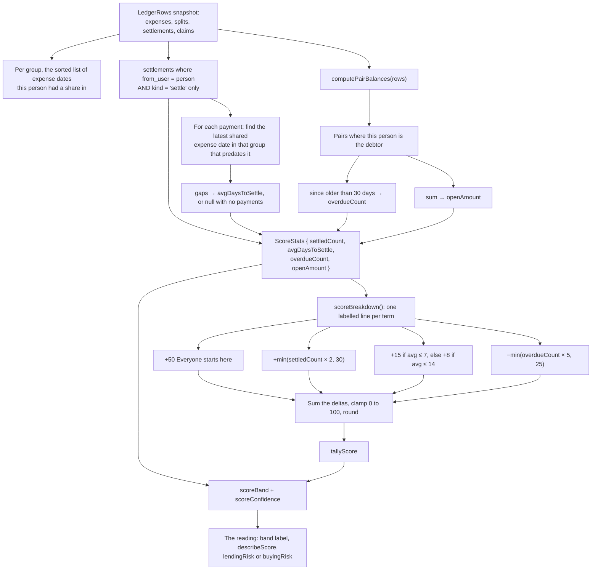
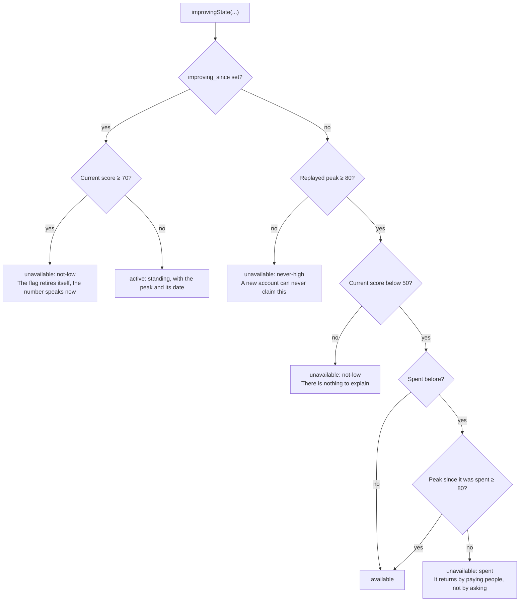
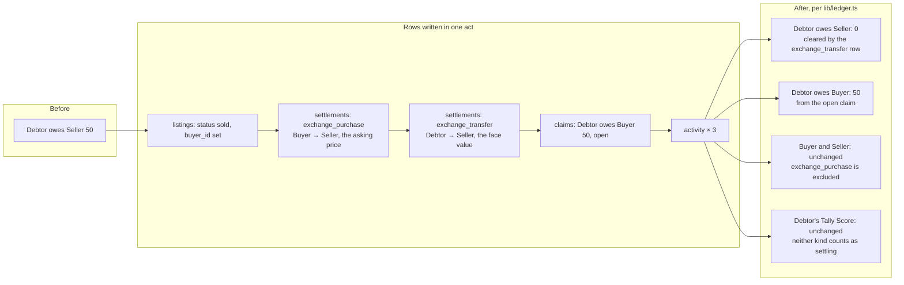

# The Ledger and the Tally Score

A split tally was a stick of notched hazel recording a debt, split lengthways in two. The creditor
kept the thicker half, the debtor kept the thinner one, and only the matching halves fit together.
Creditors who needed money early sold their halves at a discount, and that was the first market in
what people were owed.

Split Tally is that stick, including the market. Which raises the question this page has to answer:
why would anybody lend on this, or buy a debt on it?

The answer is not that the arithmetic is clever. It is that the arithmetic is visible. Every figure
on this page is computed by a pure function in `lib/ledger.ts` or `lib/score.ts` from rows the viewer
is allowed to read, and every constant is exported and named. Nothing is stored that could be
derived, because a stored number is only ever as good as the moment somebody happened to write it.

## Pair balances

The model is pairwise. Between two people, in one currency:

```
X owes Y  =  X's split shares on expenses Y paid
          −  Y's split shares on expenses X paid
          −  payments X made to Y
          +  payments Y made to X
          +  open claims where X is the debtor and Y the holder
          −  open claims where Y is the debtor and X the holder
```

`computePairBalances(rows, opts)` implements exactly that. It keys each pair by the two ids sorted
alphabetically plus the currency, so the same pair always lands in the same bucket regardless of who
is asking, and flips the sign on the way in. Amounts under a cent are dropped at the end, so rounding
noise never surfaces as "owes 0".

Three details in that function carry real weight.

**Deleted expenses do not count.** Deleting an expense is a soft delete, so the row is still there
and the splits are still there, and the loop skips any split whose expense is `deleted`.

**Settlement kind is not decoration.** `settlements.kind` has three values and each behaves
differently:

| `kind` | Written when | Effect on the pair balance | Counts toward the payer's score |
|---|---|---|---|
| `settle` | Somebody actually paid somebody back | Reduces what the payer owes | Yes |
| `exchange_purchase` | A buyer paid a seller for a tally | Excluded entirely | No |
| `exchange_transfer` | A tally changed hands | Lifts the debtor's obligation off the original creditor | No |

`exchange_purchase` is excluded because buying a tally is consideration for an asset, not a
repayment, and it must not move the pair balance between two people who were never in that trade.
`exchange_transfer` is included, because that is the row that clears the debtor's original debt to
the seller at the moment the `claims` row makes them owe the buyer instead.

Only `settle` counts toward a Tally Score. That was a bug before it was a rule: `scoreStatsFor`
originally counted `exchange_transfer` as a settled debt, so a debtor's score improved because
somebody else sold their debt. A score that can be improved by a transaction the debtor was not party
to is not a score.

**A claim is not scoped to a group.** A claim is a standing obligation between two people, so a
group filtered view skips claims entirely. That is why buying somebody's tally on the Exchange shows
up on the dashboard and in the friend view but not inside the group the original expense came from.

`balancesFor(userId, pairs)` turns those pairs into one signed number per counterparty, positive when
they owe you. `totalsFor` folds those into the two headline figures per currency on the dashboard.
`groupNets` gives each member's net position inside one group.

**Figure 21: A group ledger, with each pair's balance stated in words as well as colour**


## Debt simplification

Every group carries a `simplify_debts` switch. Off, the group lists the literal debts: each pair that
owes something. On, the ring is untangled first, so three people each owing the next 5 euros shows as
nobody owing anybody anything.

`simplifyDebts(nets)` is minimum cash flow, greedy: split members into debtors and creditors, sort
both by size, and repeatedly match the largest debtor to the largest creditor until everyone is
square. It is not provably optimal in every case, and it is honest about that in its own comment. It
is what "instead of six transfers, two" means in practice, and it always terminates with correct
balances.

A worked example, verified in QA on a three way ring: you owe Pedro 5, Pedro owes Júlia 5, Júlia owes
you 5. Literal shows three transfers of 5. Netted shows nobody owing anything.

**It is off by default, and that is the interesting decision.** Netting can ask you to pay somebody
you never borrowed from, and a balance that quietly rearranges itself is not something to opt anyone
into without asking. Flipping the switch writes into every member's feed, so nobody discovers it
silently. Applying the plan records suggestions rather than settling anything on the members' behalf.

One consequence is documented rather than hidden: the `groups` update policy is creator only, so any
other member sees a plain explanation instead of a switch that would do nothing.

**Figure 22: The same group, netted, with the plan stated in plain English**


## More than one currency

A tally stays in the currency it was made in. Pair balances are keyed by currency, so 50 euros and
50 dollars between the same two people are two separate balances and neither one is quietly
converted into the other.

The combined figure on the dashboard is a convenience laid on top. `lib/fx.ts` fetches European
Central Bank daily reference rates through `api.frankfurter.dev`, which needs no key and no account.
`convertTotals()` divides by the published rate, returns the ECB rate date so the figure can be
labelled with it, and lists every currency it had no rate for rather than folding it silently into
the total. If the endpoint is unreachable the dashboard shows the per currency figures on their own
and says so.

The distinction matters for the same reason the rest of this page does: what somebody owes you is
still 50 euros, whatever today's rate says that is worth. The converted number is an estimate. The
ledger is not.

QA reproduced the entire ledger by hand from `seed.sql`, scoped to what one account's own RLS view
returns, and compared it as exact strings. Every figure matched to the cent across the dashboard, the
friends list and two group pages at both viewports, including the live ECB conversion for the day.

---

## The Tally Score

The score answers one question: will this person actually pay? It appears wherever that question is
being asked, which is on a friend, on a listing card, on the listing detail, and inside the expense
form the moment you are about to be owed by somebody.

### The formula

`lib/score.ts` is deliberately small, and every constant is exported so the arithmetic can be checked
against this page.

**Table 11: Every term in the Tally Score, with its weight**

| Term | Constant | Weight | Condition |
|---|---|---|---|
| Starting point | `SCORE_START` | +50 | Everybody, always |
| Each settled tally | `SETTLED_BONUS` | +2 each | One `settle` payment made by this person |
| Cap on that bonus | `SETTLED_BONUS_CAP` | +30 maximum | Reached at 15 settled tallies |
| Fast settler | `FAST_BONUS` | +15 | Mean days to settle ≤ `FAST_DAYS`, 7 |
| Ordinary settler | `OK_BONUS` | +8 | Mean days to settle ≤ `OK_DAYS`, 14, and above 7 |
| Each stale tally | `OVERDUE_PENALTY` | −5 each | A counterparty still owed, oldest contributing expense more than `OVERDUE_DAYS`, 30, ago |
| Cap on that penalty | `OVERDUE_PENALTY_CAP` | −25 maximum | Reached at 5 stale counterparties |
| Clamp | | 0 to 100 | Applied last, then rounded |

The two bonuses are mutually exclusive: an average of 5 days earns 15 and an average of 12 days earns
8, never both. An average above 14 days earns nothing, which is not the same as a penalty.

A consequence worth stating, because it is the sort of thing a score usually hides: the clamp is 0 to
100 but the arithmetic can only reach **25 to 95**. Nobody can score 100 and nobody can score 0. The
clamp is a guard on the code, not a range anybody occupies.

**Flowchart 11: Computing one person's Tally Score from the rows the viewer can see**



*Source: The author (2026).*

### What "days to settle" actually means

For one payment, it is the gap between the payment and the most recent expense in that group that the
payer had a share in and that predates the payment. It is the plainest reading of "how long did they
take", and it is stated here rather than left implicit because a repayment metric with an unstated
denominator is exactly the kind of number that should not be trusted.

Payments with no `group_id`, or in a group where this person has no shared expense predating the
payment, contribute no gap at all. They still count toward `settledCount`.

### Computed on read, not trusted from a column

`profiles.tally_score` exists and defaults to 50, and it is a cache, not the truth.
`lib/scores.ts` recomputes on read wherever the history is visible, and falls back to the cached
column only for people whose history the viewer cannot see, such as a debtor in a group they are not
part of.

The reason is RLS. One user cannot write another user's profile, so the column can never be reliably
kept current for anybody but its owner. Ana can recompute her managed friend Paulo from rows she can
see, and she can never recompute Marina.

### The reading layer

A number on its own is not a judgement, and the most dangerous thing this score can do is look like a
measurement when it is really a default.

**Fifty is both the starting value and a middling result.** Somebody brand new scores 50 and somebody
with a genuinely mixed record scores 50, and those two 50s mean opposite things to anybody deciding
whether to lend or to buy. So `scoreBand()` returns `unproven` rather than `mixed` when
`settledCount` is zero, and the interface can never present an absence of information as a
measurement.

**Table 12: The bands, and the confidence behind the number**

| Band | Condition | Label on screen | What it means |
|---|---|---|---|
| `unproven` | `settledCount === 0` | No record yet | Nothing has been settled. Not a red flag, an absence of information |
| `weak` | score below 50 | Slow payer | Tallies have been left to age |
| `mixed` | 50 to 69 | Mixed record | Settles, but takes their time |
| `steady` | 70 to 84 | Reliable | Usually settles within a fortnight |
| `strong` | 85 and up | Settles fast | Has never let a tally age |

| Confidence | Condition | How to read the score |
|---|---|---|
| `none` | 0 settled | There is no history behind the number |
| `thin` | 1 or 2 settled | Read it lightly |
| `fair` | 3 to 7 settled | Reasonable, not conclusive |
| `good` | 8 or more settled | The number is doing real work |

The band and the confidence answer different questions. The band says what the record looks like, the
confidence says how much record there is. A `strong` band on `thin` confidence is two settled tallies
that happened to be quick, and the interface says so rather than rounding it up to "reliable".

On top of that sit two readings, because the two decisions genuinely differ:

- **Lending** (`lendingRisk`). Shown inside the expense form, but only when *you* are the one paying,
  and only about people whose record actually says something. It returns `null` for a good record,
  because a reliable friend should be quiet, not congratulated. For an unproven counterparty it says
  in as many words: *"That is not a red flag, it is an absence of information."*
- **Buying** (`buyingRisk`). The useful question at a listing is not "is this person good" but "is
  this discount enough for this person". So it takes both the discount being asked and the discount
  that debtor's own record would price, and says plainly when a listing is priced tighter than the
  history justifies. The sentence it writes, with the slots it fills:
  *"Priced tighter than [name]'s record justifies. [offered]% off, where their history prices closer
  to [fair]%. You are taking on the wait for less than it is worth."*

### Showing the working

`/score` is the page that makes the transparency argument concrete. It shows the dial, then the
arithmetic line by line from `scoreBreakdown()`, then `scoreEvents()`: every settlement with how long
it took, and every debt still open with how long it has been sitting there, oldest first.

The score is arithmetic on that list, so showing the list is the only complete answer to "why is my
score what it is".

`improvementTips()` closes the loop. Each tip is computed by running `tallyScore()` again with one
input changed, so the gain it promises is exactly what the formula would award. Clearing every stale
tally shows the real difference between the current score and the score without the penalty. Nothing
promises more than it can deliver.

The dial itself is drawn as tally marks: `scoreClusters()` returns 25 marks, five clusters of five,
each cluster worth 20 points. There are no progress bars and no spinners anywhere in this
application.

**Figure 23: The score page, with the dial, the arithmetic and the record beneath it**


---

## "I am improving"

A low score with no explanation tells a lender one thing. A low score held by somebody who was
reliable for a long stretch tells them something else, and this flag lets that second person say so.

The declaration itself is cheap talk, so it is not what carries the weight. The weight is in the
eligibility rule, which the ledger proves on its own.

**Flowchart 12: Who is allowed to say they are improving**



*Source: The author (2026).*

Four constants govern it: `HIGH_MARK` 80, `LOW_MARK` 50, `RECOVERED_MARK` 70, and only two columns
are stored, `improving_since` and `improving_used_at`.

**The peak is not stored.** `scorePeak()` replays the record day by day and returns the highest score
this person has ever held and when. It checks each payment date plus today, because the score only
moves when a payment lands or a debt crosses a month, so those dates catch every high point.
Deriving it beats storing it: a stored peak is only ever as good as the moments somebody happened to
look, whereas this is a property of the record itself and gives the same answer to everyone reading
it.

Every condition is checked again server side in `declareImproving()`, in
`app/(app)/score/actions.ts`, rather than trusted from the form. A client that asks nicely gets
nothing it has not earned, and each refusal names its reason: *"This is earned, not given. Your
record has to have reached 80 at some point before you can say you are working back up to it."*

Spending it is permanent until the record earns it back. It returns only if the record climbs to 80
again after the last use, which means actually paying people. It is a second chance you have to pay
for twice.

`improvingNote()` states the fact that can be checked and never the intention that cannot:
*"[name] reached [peak] at their best and has since fallen. They have acknowledged it and are working
it back up."* It never raises a score and never softens what the risk figures say. It adds the one piece
of context they cannot carry, that the drop is recent rather than the whole story. `/exchange`
carries a legend documenting every state, so the signal a market prices on is legible to everyone
using it.

**Figure 24: The improving standing on the Exchange, with the legend that documents every state**


---

## What a sale does to both sides

The Exchange is where the ledger and the score have to be right at the same time, so it is worth
tracing one sale all the way through.

**Flowchart 13: Selling a tally, and what moves where**



*Source: The author (2026).*

Three properties fall out of that, and each one is a reason somebody might trust the market:

1. **The debtor's obligation is conserved.** They owed 50 before and they owe 50 after. Only the name
   of the person they owe it to changed.
2. **The debtor's score does not move.** They did not pay anybody, so nothing improves. A market
   where selling a debt flattered the debtor's record would be a market that prices on a lie.
3. **The buyer's exposure is visible on their own dashboard**, as what they paid against what they
   are owed, per currency, labelled *"if they all pay"*. It is a position until the debtor settles,
   not a profit, and it is worded that way on screen.

Two guards sit in front of all of it. `createListing` counts what is already open against what is
left to sell, so the same fifty euros cannot be listed twice: before that check existed, a double
press on "List it" produced two live listings and two buyers would each have been promised the same
debt. Three synchronous presses now produce exactly one listing, measured. And the discount bound of
2 to 35 percent is enforced in `createListing` from whatever the seller finally chose, not just in
the slider they moved.

## Why this is the transparency argument

Put together, the case for lending or buying here is not a promise. It is a set of properties that
can be checked:

- **The score is arithmetic on a visible list.** Every term is an exported constant, the breakdown is
  rendered line by line, and the events behind it are listed with dates.
- **Nothing that can be derived is stored.** Balances, scores and the peak behind an improving claim
  are all computed on read. There is no cached number to go stale and no place for a number to be
  written that the record does not support.
- **The interface refuses to overclaim.** `unproven` exists specifically so an absence of information
  cannot be presented as a measurement, and `lendingRisk` returns nothing at all for a good record
  rather than manufacturing reassurance.
- **The comparison is the honest one.** A buyer is not asked whether a debtor is good. They are shown
  the discount on offer against the discount that debtor's own record prices, and told plainly when
  the first is smaller than the second.
- **The one thing that is not real is labelled where it happens.** Marketplace settlement is
  simulated and says so on the listing detail: *"Demo settlement: no real money moves."* Every row it
  writes to the ledger is real.

A tally stick worked because both halves had to match. This works for the same reason: the number and
the record behind it are the same object, and both are on screen.
