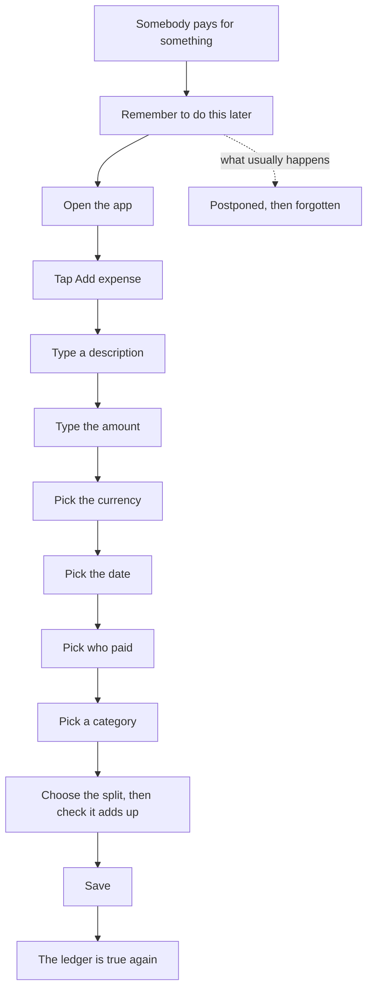
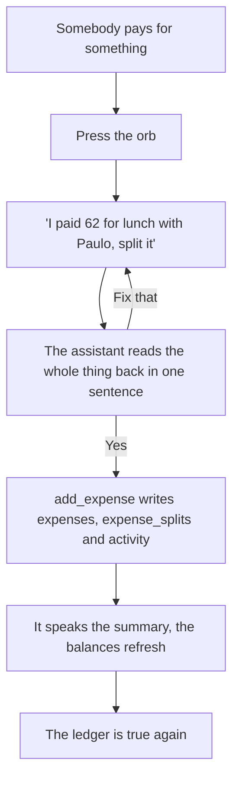

# Problem and Solution

## The problem: splitting money with friends is forms

Nobody has a shared-expenses problem. They have a dinner, a flat, a trip. The expense is a
by-product, and the by-product is what the software makes you sit down and type.

The typing is not the hard part on its own. The hard part is that it arrives at the worst possible
moment. The bill lands, somebody's card goes down, everyone stands up, and the one person who is
going to be owed money is now the person holding a phone in a doorway filling in a form. So it gets
postponed. Postponed once is fine. Postponed four times is a week of trips, rounds and taxis that
nobody can reconstruct, and the ledger stops being true.

Then there is the second cost, which no interface has ever solved by adding a field. Asking a
friend for money is socially expensive. It reads as distrust, it arrives with a number attached,
and the person asking usually decides it is not worth it. Small debts between friends are not
forgiven so much as abandoned. The person who paid absorbs it, and quietly stops offering to pay
next time.

## Why the existing tools do not fix it

Splitwise and everything shaped like it are ledgers you feed by hand. They are good ledgers. The
arithmetic is right, the history is clean, the settling-up works. But every entry in them begins
with a human deciding to open an app and describe something they already lived through, in fields.

Flowchart 1 is that loop, and the count is the point. Between the thing happening and the ledger
being true there are ten deliberate acts, seven of which are data entry.

**Flowchart 1: the incumbent loop, from the moment money moves to the moment the ledger is true**

The second cost gets no answer at all. A ledger can tell you Paulo owes you 50. It cannot get you
the 50, and it cannot make asking for it cheaper. So it sits there, correct and useless, and the
app becomes a record of a conversation nobody wants to have.

## The thesis: finance without forms

The sentence a person says out loud already contains the whole entry. "I paid 62 for lunch with
Paulo, split it" has the description, the amount, the payer, the participant and the split mode in
it. The form is not collecting information. It is asking a person to re-encode information they
have already produced, one field at a time, in an order the database prefers.

So: talking creates the data. Not talking as a shortcut into a form, and not a chat window bolted
onto a ledger. The conversation is the write path. Flowchart 2 is the same journey as Flowchart 1,
with the form deleted rather than shortened.

**Flowchart 2: the Split Tally loop, the same journey with the form removed**

Three acts instead of ten, and the two that remain are things a person does anyway: say what
happened, agree that it is right. The confirmation is not a formality. It is the only step in the
whole loop where a human is asked to check anything, which is why the assistant is instructed to
confirm the entire entry once rather than field by field.

The rest of the design follows from that one commitment. Signup collects an email and a password
and nothing else (`app/(auth)/signup/SignupForm.tsx`), because the name, the occupation, the
currency, who you share with and what you are trying to do all come from a spoken onboarding
instead. There is a manual form for every one of these things, and there always will be. The forms
are the fallback, not the product, and keeping them is what lets the voice path be judged against
something.

Table 2 is the accounting. Every field the incumbent loop asks a person to fill, and where Split
Tally gets it instead.

**Table 2: the seven fields of an expense, and where each one comes from without a form**

| Field | In the incumbent loop | In Split Tally |
|---|---|---|
| Description | Typed | Taken from the sentence |
| Amount | Typed | Taken from the sentence, capped at one million per entry (`lib/format.ts`) |
| Currency | Picked | Inherited from the group (`app/(app)/groups/actions.ts`) |
| Date | Picked | Today unless the sentence says otherwise |
| Who paid | Picked from a list | A name resolved against your friends and group members (`lib/resolve.ts`), which asks "Which Paulo?" on an ambiguous match and offers to add an unknown one |
| Category | Picked | Left null on the voice path, suggested by the model on statement rows (`app/api/categorize/route.ts`) |
| Split | Chosen, then reconciled | "Split it" means equal; named amounts become an exact split, validated by the same `resolveSplit` the form uses |

## The solution, in three moves

### 1. The voice ledger

A docked orb on every authenticated page opens a sheet with the assistant in it. Speaking runs over
WebRTC on a short-lived conversation token. Typing runs over a WebSocket on a signed URL, because a
typed conversation should not need a microphone or a media pipeline at all, and the same route
picks between them on `?transport=text` (`app/api/voice/token/route.ts`). The sheet always carries
a text input, so a refused microphone or a bad connection changes the transport and nothing else.

Thirteen client tools are registered on the agent (`components/voice/clientTools.ts`). Each one
calls a server action in `app/(app)/voice/actions.ts`, and every action funnels into the same
validated write path as the corresponding form: `addExpense` is one function, and the manual form,
the voice tool and a statement row all arrive at it. The assistant can add an expense, add a
friend, create a group, record a settlement, read your balances, read your spending, read a Tally
Score, log cash spending, close a weekly check-in, price a receivable, and take back the last entry
when you tell it that it got something wrong.

That last one is the tell. Correcting a mistake is where people abandon a ledger, so `fix_last_entry`
removes the entry and asks for it again in one sentence, rather than sending anyone to find a row.

Anything the assistant wrote is marked as such. An expense created by voice carries an orb glyph in
the list; one read from a statement carries a paper glyph (`components/app/ExpenseRow.tsx`). You can
always see which entries a machine made.

**Figure 3: the voice sheet mid-conversation, the orb responding to speech, the captions, and the confirm chips**

### 2. The statement snap

Voice covers what is shared. It does not cover the coffee you bought alone three days ago and have
already forgotten. So `/import` takes a photograph or a screenshot of a bank statement, compresses
it to a 1600px edge in the browser, uploads it to a private Supabase bucket, and sends a signed URL
to Anthropic vision (`app/api/parse-statement/route.ts`). What comes back is a list of dated,
signed transactions.

The part that makes it usable twice is the deduplication. Every parsed row gets a SHA-256 hash of
`user | date | amount | normalised description` (`app/(app)/import/actions.ts`), and any row that
already exists comes back pre-unchecked and badged, so photographing an overlapping period costs
nothing. Then the selected rows are categorised in one batch call and the budgets recompute.

There is no form here either. There is a table of things the machine believes, and a checkbox next
to each.

### 3. The tradeable IOU

This is the move that answers the second cost, the social one, and it is the one no ledger has.

If Paulo owes you 50 and cannot pay this month, a ledger's only advice is to ask him again. The
Exchange offers a third party instead. You list the receivable, `/api/price-listing` prices it from
Paulo's actual repayment record and returns one sentence saying why, you adjust inside a 2 to 35
per cent discount clamp that is enforced on the server no matter what the model answers
(`lib/pricing.ts`), and somebody who is willing to wait buys it. You are paid today. The buyer now
holds Paulo's tally.

Nobody had to ask Paulo for anything. The debt moved instead of the conversation.

For that market to work, a buyer needs to know who they are buying. The Tally Score is that,
computed transparently in `lib/score.ts`: everyone starts at 50, a settled tally is worth +2 up to
+30, settling inside 7 days is +15 and inside 14 is +8, and every debt left open past a month is
-5 down to -25. It is a small formula on purpose, because it is shown broken into its lines on
`/score` and next to every listing. The score also refuses to flatter: `scoreBand()` returns
`unproven` rather than `mixed` when nothing has been settled, so an absence of information is never
displayed as a measurement.

**Figure 4: The Exchange, with listing cards carrying the debtor's Tally Score, the discount and the AI fair price chip**

Table 3 is the three moves against the two costs.

**Table 3: what each move removes**

| Move | The cost it removes | Where it lives | What it writes |
|---|---|---|---|
| The voice ledger | The form, at the moment the form is most expensive | `components/voice/`, `app/(app)/voice/actions.ts` | `expenses`, `expense_splits`, `settlements`, `personal_transactions`, `checkins`, `activity` |
| The statement snap | Remembering what you spent alone | `app/(app)/import/`, `app/api/parse-statement`, `app/api/categorize` | `statement_uploads`, `personal_transactions` |
| The tradeable IOU | Having to ask a friend for money | `app/(app)/exchange/`, `app/api/price-listing`, `lib/pricing.ts`, `lib/score.ts` | `listings`, `claims`, `settlements`, `activity` |

## Who this is for

- **The person who always pays.** They are the one carrying the unrecorded debt and the one who has
  to ask for it back, and both of those get cheaper here.
- **People who share money but not an app.** Managed friends are profile rows with
  `is_managed = true`, added by name, no invitation required. They can be in groups, owe money and
  be listed on the Exchange. When somebody eventually signs up with a matching email,
  `claim_managed_profile()` migrates their history onto the real account.
- **Anyone who wants to see what an AI-native write path costs to build.** Every tool call lands in
  the same validated server action as the form beside it, and the whole thing is in this repository.
